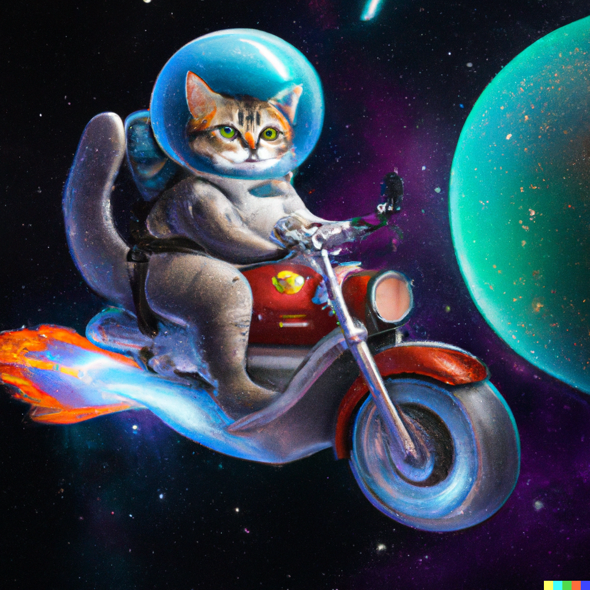

# BELAJAR HTML DASAR

- progres saya belajar HTML
- sumber: [youtube programmer zaman now](https://www.youtube.com/watch?v=hMDJyb7VkYw&t=1856s)

## apa yang saya pelajari?

### hello-world

- memulai dengan menampilkan tulisan 'hello world' menggunakan tag `<html></html>`
- menampilkan program dengan menjalankanya di server lokal menggunakan extension [live server](https://marketplace.visualstudio.com/items?itemName=ritwickdey.LiveServer)

### heading

- digunakan untuk menampilkan bagian penting pada konten web
- di HTML memuat heading hingga heading-6
- cara menggunakanya menggunakan tag `<h></h>`

### paragraph

- membuat paragraph pada HTML menggunakan tag `<p></p>`
- web browser akan menghapus enter dan spasi lebih dari satu kali jika digunakan dalam satu tag yang sama

### reserved-character

- ada banyak karakter yang sudah dipesan oleh HTML, contoh kecilnya yaitu: `<` `,` `/` dan `>`, jika memaksakan menulisnya maka akan dianggap error atau tidak akan ditampilkan
- contoh pelulisan: `<h2> Belajar <HTML> </h2>`, tulisan `HTML` tidak akan ditampilkan di web browser karena diaggap sebuah tag

### entities

- karakter yang sudah dipesan oleh HTML disebut entities
- kita tetap bisa menuliskan karakter entities secara langsung pada program, tetapi direkomendasikan menggunakan symbol entities agar lebih aman
- seluruh daftar entities HTML: [https://oinam.github.io/entities/](https://oinam.github.io/entities/)
- contoh penulisan menggunakan symbol entities: `<h2> Belajar &lt;HTML&gt; </h2>` tulisan `HTML` akan ditampilkan web browser karena sudah menggunakan symbol entities yaitu `&lt;`/`<` dan `&gt;`/`>`

### break-line

- digunakan untuk menambahkan enter pada satu tag paragraph
- cara menggunakanya dengan menambahkan tag `<br>`
- contoh:

```
<p>
    saya belajar website <br />
    dimulai dari HTML dasar
</p>
```

### horizontal-rule

- digunakan untuk menambahkan garis secara horizontal
- cara menggunakannya dengan manambahkan tag `<hr>`
- contoh:

```
<p>
    saya belajar website <hr>
    dimulai dari HTML dasar
</p>
```

### style

- menggunakan CSS sebagai styling pada HTML
- HTML memiliki atribut `style` yang digunakan untuk styling pada tulisan
- contoh sederhana menggunakan style pada HTML:

```
<p
    style="font-size: 24; color: coral">
    saya belajar website dimulai dari HTML dasar
</p>
```

### formating

- digunakan untuk menambahkan format pada teks seperti cetak tebal, garis miring, garis bawah dll
- contoh formating lengkap HTML ada di: [W3School](https://www.w3schools.com/html/html_formatting.asp)
- untuk menghasilkan teks `2^2` menggunakan tag `<sup></sup>`

### comment

- digunakan untuk komentar pada program
- comment tidak akan ditampilkan saat program dijalankan
- contoh comment pada HTML: `<!-- comment -->`

### colors

- HTML mendukung format RGB, HEX, HSL dll
- panduan lengkap tentang colors: [w3shool/colors](https://www.w3schools.com/colors/default.asp) atau [color piecker me](https://colorpicker.me)

### list

- secara garis besar ada 2 jenis list pada HTML yaitu: `ul` (unordered list) untuk list berupa simbol dan `ol` (ordered list) untuk list dengan nomor
- panduan lengkap tentang list pada HTML: [w3school/list](https://www.w3schools.com/html/html_lists.asp)

### links

- digunakan untuk menuju halaman tertentu pada website
- cara menggunakanya menggunakan tag `<a></a>`
- terdapat atribut `target` yang digunakan untuk menentukan dimana halaman akan dibuka
- berikut jenis target pada link:
  - `_self` membuka link pada jendela yang sama
  - `_blank` membuka link pada jendela baru
  - `_parent` membuka link pada frame induk
  - `_top` membuka link pada jendela penuh
- terdapat dua jenis url pada link yaitu:
  - `absolute url` merupakan url lengkap dengan https, digunakan ketika ingin merujuk pada website lain
  - `relative url` merupakan url tanpa https relative kepada file project sendiri, digunakan ketika merujuk pada laman website sendiri
- panduan lengkap tentang links pada HTML: [w3school/links](https://www.w3schools.com/html/html_links.asp)

### bookmark

- bookmark digunakan untuk tautan pada bagian tertentu di laman web
- pada website dengan halaman panjang disarankan menggunakan bookmark
- cara menggunakanya yaitu menambahkan value yang sama pada atribut href `#value1` dan atribut id `value1`

### image

- digunakan untuk menampilkan gambar dengan tag ``
- terdapat 2 required atribut yaitu `src` tampat menyimpan link gambar dan `alt` merupakan keyword gambar yang digunakan crawling serach engine seperti google
- secara default ukuran gambar akan ditampilkan sesuai dengan gambar aslinya
- dapat mengubah ukuran gambar menggunakan bantuan CSS dengan atribut width dan height dengan satuan px/pixel atau persentase % dari ukuran gambar asli

### picture

- sama seperti image tetapi picture memiliki fitur penyesuaian ukuran dari sebuah ukuran media
- contoh:

```
<picture>
    <source media="(max-width: 500px)" srcset="pic.png" />
    <source media="(max-width: 1000px)" srcset="pic2.png" />
    
</picture>
```

- ketika lebar media <= 500px maka akan menampilkan pic.png
- ketika lebar media >= 500px dan <= 1000px maka akan menampilkan pic2.png

### pre

- digunakan untuk menampilkan ketikan dengan apa adanya
- cara menggunakanya dengan menambahkan tag `<pre></pre>`
- apapun yang kita ketikan akan ditampilkan walaupun itu sebuah spasi atau enter

### emoji

- sama seperti entities, emoji juga memiliki symbol untuk menampilkannya
- berikut daftar symbol lengkap pada HTML: [www.quackit.com/character_sets/emoji/](https://www.quackit.com/character_sets/emoji/emoji_v3.0/unicode_emoji_v3.0_characters_all.cfm)

### head

- digunakan menyimpan title, metadata, styling CSS eksternal maupun script javascript

### display

- ini termasuk konten pada CSS
- secara garis besar display memiliki 2 jenis yaitu block dan inline
- block mengambil seluruh konten dari kiri ke kanan sesuai lebar media
- inline hanya mengambil elemen yang sejajar tanpa mengambil seluruh lebar
- jika ingin menampilkan style yang berbeda pada satu baris konten bisa menggunakan tag `<span></span>`
- contoh lengkap block pada CSS: [revou.co/panduan-teknis/display-css](https://revou.co/panduan-teknis/display-css)

### video

- menggunakan tag `<video></video>` tan atribut controlls untuk menampilkan kontrol dari video tersebut
- dapat mengguanakn video dari project atau video dari link website lain seperti youtube
- panduan lengkap tentang video HTML: [www.w3schools.com/html/html5_video](https://www.w3schools.com/html/html5_video.asp)

### audio

- sama seperti video, audio tinggal menggunakan tag `<audio></audio>`
- panduan lengkap tentang audio HTML: [www.w3schools.com/html/html5_audio](https://www.w3schools.com/html/html5_audio.asp)
